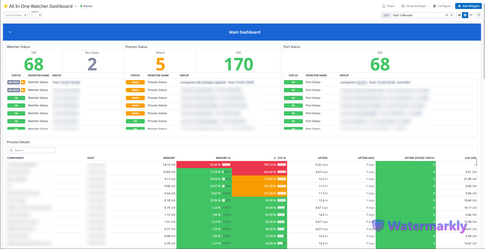

# Component Watcher (All-in-One-Watcher)

## Overview

The **Component Watcher** (`component_watcher.py`) is an advanced monitoring solution for Unix-based systems that provides comprehensive process monitoring with cloud integration. It features automatic restarts, rich alerting, and deep integration with AWS services and Datadog monitoring.

## Features

- **Multi-Component Monitoring**: Simultaneously monitor multiple components with thread-based parallelism
- **Intelligent Process Management**:
  - Automatic process restart capabilities
  - PID tracking and validation
  - Process lifespan monitoring (maxUpDays alerting)
- **Cloud Integration**:
  - AWS Secrets Manager for credential management
  - AWS SES for email notifications
  - Datadog metrics integration (process stats, port status, watcher health)
- **Rich Notifications**:
  - HTML email templates with component details
  - Configurable alert thresholds
  - System metadata inclusion (hostname, IP, timestamps)
- **Advanced Monitoring**:
  - Process resource tracking (CPU, memory, uptime)
  - Log directory size monitoring
  - Port availability checks
  - Watcher health status reporting
- **Flexible Configuration**:
  - YAML-based main configuration
  - Component-specific INI configurations
  - Dynamic logging with component-specific context
  - Configurable check intervals

## Prerequisites

- Python 3.9+
- Unix-based operating system
- Required Python packages:
  - `boto3`, `botocore` (AWS integration)
  - `loguru` (logging)
  - `psutil` (system monitoring)
  - `datadog` (metrics collection)
  - `pyyaml` (YAML configuration)
  - `requests` (HTTP requests)

## Configuration

### File Structure

```bash
├── component_watcher.py  # Main monitoring script
├── config/
│   ├── appconfig.yaml    # Primary configuration
│   └── components.ini    # Component definitions
└── logs/                 # Auto-rotated log storage
```

### appconfig.yaml Structure

```yaml
mail_configs:
  from_address: "alert@yourdomain.com"
  to_address: "admin@yourdomain.com"
logs_size_send: True
process_details_send: True
aws_secrets_manager:
  secret_name: "prod/smtp-credentials"
  region_name: "us-west-2"
```

### config.ini Example

```ini
[SearchService]
tag = search-service
port = 8080
startTime = 00:00:00
endTime = 23:59:59
runningDates = [0,1,2,3,4,5,6]
maxUpDays = 7
name = Search Service
needToUp = Yes
needToSendMail = Yes
runScriptPath = /apps/search-service
logDirectory = /apps/search-service/logs
runScript = run.sh
```

## AWS Secrets Manager Requirements

### Create a secret containing:

```json
{
  "USERNAME": "SMTP_USERNAME",
  "PASSWORD": "SMTP_PASSWORD",
  "SMTP_SERVER": "email-smtp.us-west-2.amazonaws.com"
}
```

## Monitoring Metrics

### The watcher reports these metrics to Datadog:

| Metric Name                          | Description                                       | Tags                            |
| ------------------------------------ | ------------------------------------------------- | ------------------------------- |
| `feed.component.process.status`      | Process running state (0=OK, 1=Stale, 2=Critical) | `component:<name>`              |
| `feed.component.port.status`         | Port availability (0=Open, 2=Closed)              | `component:<name>, port:<port>` |
| `feed.component.process.up_time`     | Process uptime in seconds                         | `component:<name>, pid:<pid>`   |
| `feed.component.process.memory.used` | Memory usage in MB                                | `component:<name>, pid:<pid>`   |
| `feed.component.log_directory.size`  | Log directory size in MB                          | `component:<name>`              |
| `feed.component.watcher.status`      | Watcher health status (0=OK)                      | `-`                             |

## Security Considerations

- **IAM Roles:** Follow the principle of least privilege for IAM roles.
- **Secrets Management:** Ensure secret manager ARNs are properly scoped.
- **Dependencies:** Keep Python dependencies updated.
- **Log Reviews:** Regularly review logs for anomalies.
- **Encryption:** Encrypt configuration files at rest.

## DataDog Monitoring

### DataDog Dashboard


